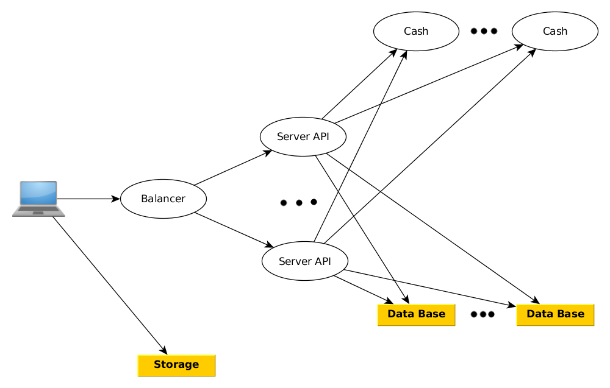

# Music-service

## Задачи

1. Прослушивание музыки
2. Создание плейлистов
3. Поиск песен
    * по исполнителю
    * по названию
    * по жанру
    * по году

## Взаимодействие со сторонними сервисами

1. Авторизация
2. Пользователи
3. Счётчики числа прослушивания песен 

## Архитектура



## Хранение данных

* Бинарные файлы - на жёстких дисках (хранилища типа amazon s3)
* Информация о песнях - в NoSQL базе данных (возможно MongoDB)

* Кэш

## Технологии
   * REST ful service

## API
Решено сделать restful сервис, поэтому rest api:

* Поиск песен

   `GET /search?id={ID}&name={NAME}&artist={ARTIST}&genre={GENRE}&year={YEAR}`

   RESPONSE:
   ```
   [
      {
       "id": "ID",
       "name": "Song",
       "artist": "Artist",
       "genre": "Genre",
       "year": 2017,
       "album": "Album",
       "text": "Text",
       "duration": 100,
       "ref": "/fdsfsdf/gfdgdf/4dfs/34/song.mp3",
       "isAvailable": true
      }
   ]
   ```

* Создать плейлист

   `POST /playlists`

   BODY: 
   ```
   {
      "id": "abcdef1234567890",
      "name": "NAME",
      "songsIds": [
       "id1",
       "id2"
      ],
      "isAvailable": true
   }
   ```
 
* Получить плейлист

   'GET /playlists/{ID}' 
   
   RESPONSE:
   ```
   {
      "id": "abcdef1234567890",
      "name": "NAME",
      "songs": [
         {
            "id": "ID",
            "name": "Song",
            "artist": "Artist",
            "genre": "Genre",
            "year": 2017,
            "album": "Album",
            "text": "Text",
            "duration": 100,
            "ref": "/fdsfsdf/gfdgdf/4dfs/34/song.mp3",
            "isAvailable": true
         }
      ],
      "isAvailable": true
   }
   ```

   
* Обновить плейлист
   
   `PUT /playlists/{ID}`
   
   BODY: PLAYLIST
 
